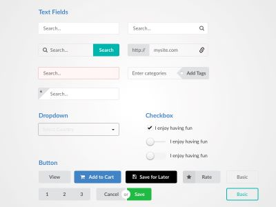

## UI Framework - Semantic UI
UI framework is like the cosmetic for HTML, it make it look more stand out and easy to view. Many website out there does not use pure HTML because of the lack creative look of the basic, but with UI framework everything stand out more and look much more smooth. There are many UI framework out there and Semantic UI is one of it. Company like "SnapChat" use Semantic UI for there website. Semantic UI treats words and classes as exchangeable concepts. Classes inside use syntax from normal natural language like noun and modifier relationship, word order, and plurality to link concepts intuitively. Semantic UI also help the process of making a beautiful website easier and fast. Semantic UI is not hard to understand or learn because it use natural language, but mastering it may take time. It have so many chose on making buttons, menu, and etc.

## For Sure Worth The Time
Because UI frameworks are not simple and can take up a lot of time, but it for sure worth the time. When I first did not know the exit of Semantic UI, all I know to create was a boring looking website that make me not so interesting in HTML. However, when I start learning Semantic UI, it open a whole new world to me, showing all the possibility that I could do. Semantic UI help me learn that making a good looking website it not that hard after all. Also, UI frameworks like semantic UI can help speed up the process of the number of line of code too, because all it need is div and class name.

## Time and Money Saving Tool for Software Engineering
When doing a software engineering work without any framework it mean more time and money will need to be spend because you will have to start from the start and build everything on your own. Working or building software with framework make it more efficient because all the basic package is there and do not have to start from scratch which will save a lot time. It often more secure to use framework, any widely used framework get a big team and online community behind, so if any bug or problem happen it can be fix fast. However, if you are working by yourself it can be hard to debug and could lead up to spending money. When working on a bigger projects with many teams involved, using a framework come in handy. By having the framework in place already, one major part of the project won’t be a concern. In conclusion, Framework going save money and time for Software Engineering when it come to the real life.
 