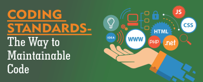

        

## Coding Standards
    Different kind of language has a different kind of grammar rules. Same as human language, computer language have grammar rules called the coding standards. The coding standard helps reading the language like java, C, javascript, etc much easier. When the language types the way that you do it too, makes it more understandable. Coding standards for computer language are normally called lint which is like software that helps you correct mistakes like a syntax error. Just like spell check, most of the lint system shows a red line under to display error.
    
## Not only help fix but learn too
    If I can only implement one software engineering techniques to improve quality, I would choose coding standards. I agree that coding standards not only help fix mistake but it improves and helps learn the programming language. When in the progress of fixing all the red line or error you are actually learning what want wrong and not make the same mistake again. Human is smart, they learn from the mistake because you know that next time you will save up much more time in fixing error if there are less or no error. Coding standards also give you an idea or other ways to process the situation some time, teaching new functions or language to fix the really useful problem. If everyone following the coding standards than learning and reading program language will be much easier.
    
    
## No Pain. No Gain
    After the first week of using ESLint with Intellij, my impressions are "dam, why I only know about this now". With ESLint my code looks much more organized and formatted for reading. ESlint could be the best coding standards software I have ever use. Even though I have no use much but ESlint is better than checkstyle that I have used for java. ESlint help me become a much better and responsible coder. Letting me know that later on when I need to work with other people and they need to understand my code, I will thank him.
