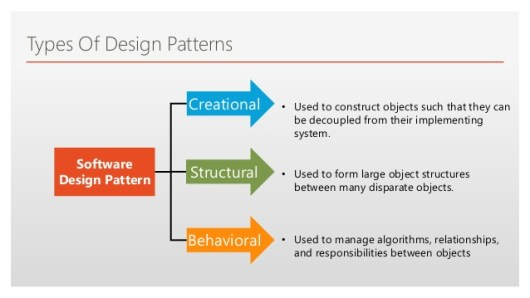

## Software Engineering Reusable Solution
In Software Engineering, there are somethings called the design patterns. According to Christopher Alexandr design pattern describes a problem that occurs over and over again in our environment, and then describes the core of the solution to that problem, in such a way that you can use this solution a million time over, without ever doing it the same way twice. I would summary this as pattern is template that help save brain cells.

## How is Design Pattern describe
Object Orientation Design Patterns show relationship and interaction between classes or objects, without specifying the final application classes or objects. Normally design pattern came with name, problem description, solution description, and consequences of when describing a design pattern. 



## Types of Design Pattern
The three main type of design pattern can be catalog into this three. Creational, Structural, and Behavioral. For example, the one common design pattern problem are Factory. Factory Problem is create objects without exposing underlying logic. Advantages over object orientation class constructor like allow return objects from different classes and disadvantages of being more complicated than normal objects Orientation class constructor.

## daily use of design pattern
The singleton design pattern is a creational pattern, whose objective is to create only one instance of a class and to provide only one global access point to that object. A singleton design pattern will include a private static variable, a private constructor, and a pulic static method. For example:
```aidl
public class HelloSingleton {
	// create an instance of the class.
	private static HelloSingleton instance = new HelloSingleton();

	// private constructor, so it cannot be instantiated outside this class.
	private HelloSingleton() {  }

	// get the only instance of the object created.
	public static HelloSingleton getInstance() {
		return instance;
	}
}
```