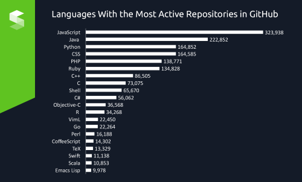
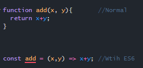

## Feeling about Javascript And ES6
  Personally, I like Javascript and prefer javascript over java and C. Javascript seems more basic and can shorten the line of code needed to type. Javascript can be tested and written on chrome which is pretty cool compared to C which needs a compiler. So, overall right now Javascript makes me feel comfortable. Also, ES6 help make Javascript even better, making let and const helping javascript to be more staple and arrow function is what interests me the most. When writing function for code normally looks like this:

This just makes everything more simple and easy to type. No need {}, and everything in one line. 

## Good or Bad programming Language
  Even though I feel comfortable about it and like Javascript, but Javascript could be a bad programming language. Shorten and simple make Javascript much more easy to use, but because the no type inside javascript makes it feel like it, not that object orientation language. No type can lead to problems and bugs later on. When a val is an integer, string, etc. Some good part about Javascript is if you use it carefully and make bound is a much faster and simple language to use and you only need chrome and internet.
  
## Thoughts Of the Class
  I found the class very interesting and I agree with the athletic software engineering learning style. It going to help me develop fast coding speed, work under stress, multitasking skill, and just a better programmer. Also, I found the WODs very useful, it a good practice with a time limit, which makes me feel stressful, but when I complete in time I feel proud and relieved. The WODS also help develop complex problem-solving skill. The style of learning in the class have positive and negative part of it. Some positive parts are essay and WODS practice in class with classmate, this help improves teamwork, writing skill, and communication skills. Some negative point is no lecture, the only screencast so far. I would recommend lecture and screencast. So, the class is fairly stressful, but I like it and feel enjoyable at the same time. I like being a challenge and a self-learning style. So, I think it works with me. 
