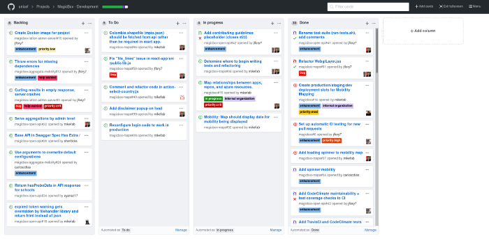

## Software Engineering II
Different from other class I have taken, this class does not teach but start with a project that take the whole semester. Students in the class is separated into 4 teams of 8 - 9 people. Personally think this way of learning is better than other class that have homework, quiz, and others. Give people a feel of the real life.

## Opportunity to work with HEI
The class give us opportunity to work with a real company called HEI, give us the chance to learn and improve our skills in software Engineering. HEI give the class what they want for a site, and the four team will try to meet the goals. The project bring in how the field could be like giving us milestone with due date. So, we know when to get this working like a real life company would have. 

## The Starts
Everything starts with introduction to the team. Get to know the team than we talk about a mockup of the pages. I was assign the feedback, and the about page. The feedback page is for user to feedback when encounter an error or need help and about page is just info about the company. Each milestone the whole team make goals that we want by the milestone and if one can not make it we all could help, or it passes down to the next milestone.

## Teamwork
The project was not a solo work is a teamwork. The most important part in this class is how to time management and work as a team. Our team have 1 to 2 meeting each week to talk about the project so everyone can be up to date on it. We use github project board to organize of workflow. So, everyone got ticket and tasks to do. With the help of the meeting and github project, the team, and I learn a lot about time management. Since each milestone got a due date, and some task depends on of the completion of others, So the meeting helps us solve this problem.

