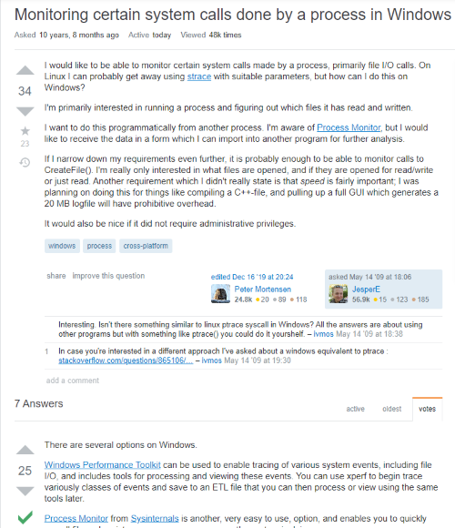

## Why Smart Question
  Have you been mad, when answering a very dumb question and meaningless question? Did it make you feel annoy and do not want to answer? That why we should not ask a dumb question and ask a smart clear question. Asking a dumb question can lead to no response, no useful information, and the need to ask another question on the same topic which wastes a lot of time. Ask smart questions is not hard, but just take time to learn and create. Asking a smart question can lead to better answers and more answers. Smart question is more detail so, people can answer them clearly and you can gain the most out of it. Being a software engineer one good skill to have is to be able to ask smart questions. If you face a coding problem and went stack Overflow, asking a smart question can lead to a faster answer, a detailed answer, and give the respondent a clear understandable question. Smart questions will get upvoted fast in Stack Overflow, which leads to more people have seemed it and will answer it. More answers are always better than one answer. Also, asking a dumb question on Stack Overflow can cause the question to be downvote and removed.
 
## How to Ask or Create Smart Question
  Compare to a simple question, smart questions are more detailed, clear, and easy to answer. Smart questions should be a question that you can not answer but still have an idea of what is happening. If the question can be google or answer but someone you know then does not post that question online because that is not a smart question. The smart question should be clear on the subject, easy to answer, and benefits. Smart questions about food should not be in Stack Overflow which is on the wrong subject. For example, this question I found in Stack Overflow. 

This question is clear, detail of what the asker wants, and smart. This question was asked 10 years ago, but still got an update on the answer and question edit till today. The answer was edited often showing that the question is a challenge which keeps respondent more excited. Which is good, making respondents do research and give you the best answer they could find. 
Now here is a not so Smart example question on Stack Overflow:

The question is super off topic which leads to removed after only being up on Stack Overflow last than a day. This question is clear, but is off-topic and the answer can be found online from google. Stack Overflow is for help on code or programming help. 

## Gain
  Learning about a smart question and going through Stack Overflow for a question. Help me develop a basic understanding of how Smart questions should be like and not smart are. The skill and knowledge to ask a smart question can save up a lot of time for people to understand the question and give me a clear answer to it. Smart questions not only use online but very useful in the real-life as well, able to ask a smart question in class or to a co-worker can help you learn faster and get closer to each other. So, smart questions help get a faster, detailed, and clear answer. 

Reference:
Stack Overflow example: <a href="https://stackoverflow.com/questions/864839/monitoring-certain-system-calls-done-by-a-process-in-windows">GoodQuestion</a> <a href="https://stackoverflow.com/questions/59995639/is-there-any-good-way-to-learn-sql-queries">BadQuestion</a>

Reading Source: <a href="http://www.catb.org/esr/faqs/smart-questions.html">READING</a>
