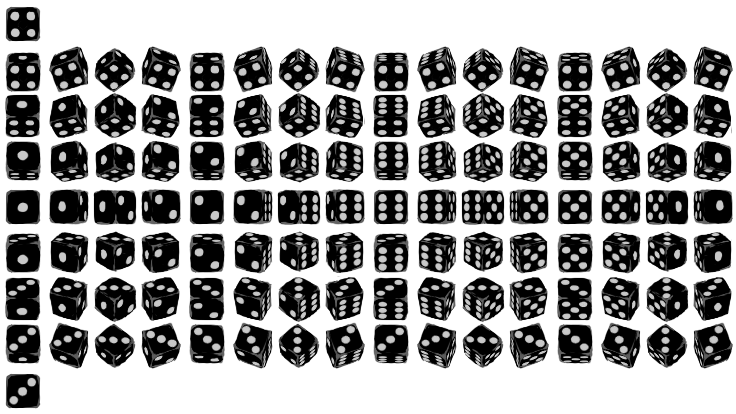

  This was the final project for the class ICS 111, the project required students to team up with 2 to 4 people and create anything that uses thing we learn in class. The game name was dice and monster because it uses three dice to do damage to a monster in the game. The game goal is to kill as many monsters as possible in the given health. Every time a player starts the game, the player can choose between the three heroes and each hero got its own attack damage, defend, and health. After the selection of the hero,the player is sent to a randomly generated map, which gives them a new experience every time they play. The player can control the movement of the character by W, A, S, D. Monster is found in the bush, which is also randomly generated to be different every time. If the player kills themonster, the soul counter goes up and the player earns mana from it. Mana can be used in the temple on the map to heal up the hero.
  
  
  My role in this project is the artist and the programmer. I was responsible for 70 % of the monster design and coding and java class. For the code part, I was responsible for damage indicator, score counter, movement, the balance of hero or monster,and the dice. The part that takes most time was the dice and damage indicator. Damage indicator was hard because it includes allthe monster and hero health, damage, and defend, and the display correctness on the screen. The dice was hard because I need to use sprite sheet which I was not sure how to use it, but after free try I know now.
  
  
 I Learned how to use pixel to design and draw pictures, teamwork, debugging, and sprite sheet in the process of making this game. Because of all the picture was drawn by me and chakhon, we feel that we are better at drawing with pixels. Working with someone is always better than by yourself, we helped each other when one of us does not understand. The funniest part and learn the most was debugging, of course, the game did not go as planned as the first few time but with time and teamwork, we were able to correct all the mistakes.
 
 Source: <a href="https://github.com/yiwenc22/Dice-and-Monswer.git"><i class="large github icon"></i>Dice&Monster</a>
 
 Gameplay on Youtude: Source: <a href="https://www.youtube.com/watch?v=Nr1R9RVr3mc&t=0s">Youtude</a>

  
