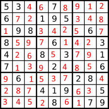

   The project was about creating an algorithm that can solve given sudoku. If the sudoku has no answer it should say it can not be solved. The project was given by the class ICS 211. We are required to use the recursive function in java to build the algorithm that can solve any given sudoku. The algorithm should solve a block by block and try and error until it gets the answer. The project also required a test for debugging and checking.
   
   This was an individual project, so I was responsible for everything in the project. I have to write function, class, and tests for the algorithm. All the function that used to solve the sudoku have to recursive, and the sudoku was in hex decimal which makes it much harder to solve because is 16 x 16. 
   
   This project helps me understand the recursive function and how it can help to do try, error, and check. The project also helps me understand how to develop a test to check if the code was working fine or not. The most important thing I learn was critical thinking and problem solving when I face problem in the function or class I try to use a different of thinking or tracing the code if the code is working or not.
   
Source: <a href="https://github.com/yiwenc22/Source-code.git"><i class="large github icon"></i>Sudoku</a>
