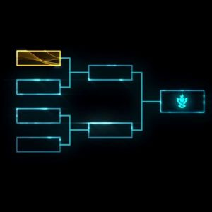

  Clash is a speical event in the game League of Legends, Player are required to make a team of five and a team name to join clash. There are 8 team in each clash battle. Winning the clash give all five player reward and in game flag and trophy. Each player are required to play a role, Mid, top , bot, jungle, or support. Each role have it own use and game can not win without any of them. To win the clash and get to first place you need to beat 3 teams in a role. 
  
  My role in the Clash was creator and MID lane. I was the one that created the team and invited 4 more people into the team. And in game I am playing as Mid Lanes, The map of the game have three lanes top, mid, bot, and between top and mid or mid and bot are the jungles. Normal game set is one top, one mid, two bot, and one jungle. And as a mid lane my responisble was to help top lane or bot lane when I have time and tell the team what is happen at mid lane at the same time. Mid Lane is important because of I am in between the two lanes, so it up to me to help them win the lane when I am doing ok in my lane.
  
  What I learn from this clash is we need to team work, trust, and skills to win. Trash talking or blaming other is not going help win the game. Being calm and communicate with everyone in the team is the way to win the games and get all the award.

Clash Explained: <a href="https://na.leagueoflegends.com/en/featured/clash#/">Leauge of Legends Clash explained.</a>

