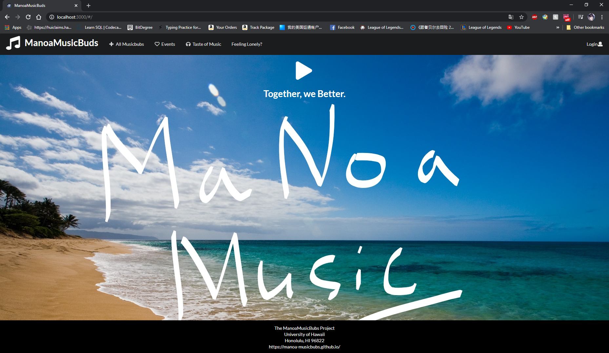

  This was the final project for the class ICS 314. Site Description: <a href="https://manoa-musicbubs.github.io/"><i class="large github icon"></i>Info</a>
  
  My role in this project is the programmer and responsible for the profile page, sign up, in a page, and data base info. I have to develop a page for the user to change their info after account sign up. I came up with the default data base for the site, and keep data and form of the users email and password.
  
  
 I Learned that Working with someone is always better than by yourself, we helped each other when one of us does not understand. The funniest part and learn the most was debugging, of course, the site does not always function as planed but with time and teamwork, we were able to correct all the mistakes. Learn how to make site look better and function better.
 
 Site Description: <a href="https://manoa-musicbubs.github.io/"><i class="large github icon"></i>Info</a>
 
 Source: <a href="https://github.com/manoa-musicbubs/manoa-musicbuds-source"><i class="large github icon"></i>MMUsicBuds</a>
  
